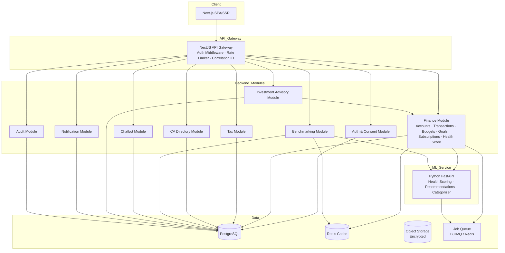

# Design Document: PeakPurse Platform

## Overview

PeakPurse is a web-based intelligent personal finance platform for Indian users. It unifies budgeting, tax filing, CA discovery, social benchmarking, subscription tracking, investment planning, and a conversational AI assistant into a single integrated experience.

The platform is delivered as a responsive Next.js web application backed by a NestJS modular monolith, a Python/FastAPI ML service, PostgreSQL as the primary database, and Redis for caching. The architecture is designed to evolve from a modular monolith to microservices as scale demands.

Key design goals:
- India-first: INR, Indian tax law (80C/80D/80CCD), DPDP Act 2023, SEBI RIA regime compliance
- Explainability: every score, recommendation, and tax computation exposes its reasoning
- Privacy by design: consent-gated data flows, data minimization, differential privacy for benchmarking
- Regulatory safety: educational framing for investments, ERI disclaimer for tax, no unregistered RIA activity

---

## Architecture

### Architectural Style

Modular monolith with clear domain boundaries, deployable as a single unit initially and decomposable into microservices later. All inter-module communication happens through well-defined service interfaces (TypeScript interfaces + NestJS dependency injection), making future extraction straightforward.



### Request Flow

1. Client sends HTTPS request → API Gateway validates JWT, attaches correlation ID, enforces rate limit
2. Gateway routes to the appropriate NestJS module
3. Module performs business logic, reads/writes PostgreSQL, reads Redis cache where applicable
4. Heavy async work (statement parsing, ML scoring, benchmarking recomputation) is enqueued to BullMQ
5. Background workers consume the queue and update PostgreSQL; Notification module dispatches alerts
6. ML Service is called via internal HTTP from Finance/Benchmark modules for scoring and recommendations

### Cross-Cutting Concerns

- **Correlation IDs**: generated at gateway, propagated via HTTP headers to all downstream calls including ML Service
- **Rate limiting**: 100 req/min per IP on public endpoints (Redis-backed sliding window)
- **Structured logging**: JSON logs with correlation ID, service, endpoint, status, latency on every request
- **Feature flags**: stored in PostgreSQL, cached in Redis, evaluated at module level — no deployment required for rollout
- **HTTPS enforcement**: 301 redirect for all HTTP requests; TLS 1.2+ on all endpoints

---

## Components and Interfaces

### Auth & Consent Module

Responsibilities: registration, login, JWT issuance, TOTP 2FA, refresh token rotation, RBAC, consent management, device recognition.

```
POST /api/v1/auth/register
POST /api/v1/auth/login
POST /api/v1/auth/logout
POST /api/v1/auth/refresh
POST /api/v1/auth/2fa/enable
POST /api/v1/auth/2fa/verify
GET  /api/v1/consent
POST /api/v1/consent/:purpose/grant
POST /api/v1/consent/:purpose/revoke
POST /api/v1/users/delete-request
GET  /api/v1/users/export
```

JWT access tokens expire in 15 minutes; refresh tokens expire in 7 days and are rotated on use. Passwords stored as bcrypt hashes (cost factor ≥ 12). Device fingerprints stored per user; unrecognized device triggers email alert.

Account lockout: 5 failed attempts in 10 minutes → 15-minute lock + email notification.

Roles: `User`, `CA`, `Admin`. RBAC enforced via NestJS Guards; 403 returned for unauthorized resource access.

### Finance Module

Responsibilities: accounts, transactions, categorization, budgets, goals, subscriptions, health score snapshots, recommendations cache.

```
GET/POST       /api/v1/accounts
GET/POST/PUT/DELETE /api/v1/transactions
POST           /api/v1/transactions/bulk-recategorize
GET            /api/v1/budgets
POST           /api/v1/budgets
GET            /api/v1/budgets/summary
GET            /api/v1/goals
POST           /api/v1/goals
GET            /api/v1/goals/summary
GET            /api/v1/health-score
GET            /api/v1/health-score/trend
GET            /api/v1/subscriptions
GET            /api/v1/subscriptions/summary
POST           /api/v1/subscriptions/:id/tag
GET            /api/v1/recommendations
POST           /api/v1/statements/upload
GET            /api/v1/statements/:jobId/status
```

Aggregate endpoints (budget summary, health score, subscription summary) are cached in Redis with 60-second TTL. Cache is invalidated on any write to the underlying data.

### Tax Module

```
GET/POST /api/v1/tax/profile
POST     /api/v1/tax/profile/auto-populate
GET      /api/v1/tax/compute
POST     /api/v1/tax/export
GET      /api/v1/tax/deduction-opportunities
POST     /api/v1/tax/form26as/upload
```

All tax computation events are logged to Audit Module with timestamp, user ID, FY, and SHA-256 hash of input data.

### CA Directory Module

```
GET  /api/v1/ca/search
GET  /api/v1/ca/:id
POST /api/v1/ca/leads
PUT  /api/v1/ca/leads/:id/respond
POST /api/v1/ca/:id/rate
```

Documents shared between users and CAs stored in encrypted object storage; access via time-limited signed URLs (1-hour expiry).

### Benchmarking Module

```
GET /api/v1/benchmark/summary
GET /api/v1/benchmark/cohort
```

Cohort aggregates recomputed weekly via background job. Minimum cohort size: 50 users. Differential privacy noise applied (ε ≤ 1.0) before publishing aggregates.

### Chatbot Module

```
POST /api/v1/chat/query
GET  /api/v1/chat/sessions
GET  /api/v1/chat/sessions/:id
```

Intent confidence threshold: 0.7. Below threshold → clarifying question. Maintains 10-turn context per session. Sessions stored for 90 days.

### Investment Advisory Module

```
GET/POST /api/v1/investment/risk-profile
GET      /api/v1/investment/plan
PUT      /api/v1/investment/plan/:goalId/override
```

Recommendations at asset category level only (no specific fund/stock names) unless operating under SEBI RIA. Budget conflict flagged when total SIP > monthly savings surplus.

### Notification Module

Internal service; no public endpoints. Triggered by events from other modules. Delivers via in-app (≤30s) and email (≤5min). User preferences stored per notification type per channel.

### Audit Module

Internal service. Append-only log table. Retains records for 5 years. Emits alert when job queue depth > 500 or error rate > 1% over 5-minute window.

### ML Service (Python/FastAPI)

```
POST /internal/ml/health-score
POST /internal/ml/recommendations
POST /internal/ml/categorize
POST /internal/ml/categorize/batch
```

Called only from within the backend network. Returns feature contributions alongside scores for explainability. v1 uses rule-based logic; v2+ uses trained models.

---

## Data Models

### User

```sql
users (
  id            UUID PRIMARY KEY,
  email         VARCHAR(255) UNIQUE NOT NULL,
  password_hash VARCHAR(255) NOT NULL,       -- bcrypt, cost ≥ 12
  email_verified BOOLEAN DEFAULT FALSE,
  role          ENUM('user','ca','admin') DEFAULT 'user',
  totp_secret   VARCHAR(255),                -- encrypted at rest
  risk_profile  ENUM('conservative','moderate','aggressive'),
  created_at    TIMESTAMPTZ DEFAULT NOW(),
  updated_at    TIMESTAMPTZ DEFAULT NOW()
)

device_fingerprints (
  id          UUID PRIMARY KEY,
  user_id     UUID REFERENCES users(id),
  fingerprint VARCHAR(255) NOT NULL,
  last_seen   TIMESTAMPTZ,
  created_at  TIMESTAMPTZ DEFAULT NOW()
)

refresh_tokens (
  id          UUID PRIMARY KEY,
  user_id     UUID REFERENCES users(id),
  token_hash  VARCHAR(255) NOT NULL,
  expires_at  TIMESTAMPTZ NOT NULL,
  revoked_at  TIMESTAMPTZ,
  created_at  TIMESTAMPTZ DEFAULT NOW()
)
```

### Consent

```sql
consent_records (
  id           UUID PRIMARY KEY,
  user_id      UUID REFERENCES users(id),
  purpose      ENUM('transaction_categorization','benchmarking','ca_sharing','marketing'),
  granted_at   TIMESTAMPTZ,
  revoked_at   TIMESTAMPTZ,
  created_at   TIMESTAMPTZ DEFAULT NOW()
)
-- Retained minimum 3 years per Requirement 2.7
```

### Accounts & Transactions

```sql
accounts (
  id           UUID PRIMARY KEY,
  user_id      UUID REFERENCES users(id),
  type         ENUM('bank','credit_card','wallet','upi','other'),
  provider     VARCHAR(255),
  currency     CHAR(3) DEFAULT 'INR',
  sync_status  ENUM('manual','aa_synced','statement_imported'),
  created_at   TIMESTAMPTZ DEFAULT NOW()
)

transactions (
  id              UUID PRIMARY KEY,
  account_id      UUID REFERENCES accounts(id),
  user_id         UUID REFERENCES users(id),
  date            DATE NOT NULL,
  amount          NUMERIC(15,2) NOT NULL,
  merchant_name   VARCHAR(255),
  description     TEXT,
  category_id     UUID REFERENCES categories(id),
  category_source ENUM('rule','ml','user_override'),
  is_recurring    BOOLEAN DEFAULT FALSE,
  tax_relevant    BOOLEAN DEFAULT FALSE,
  notes           TEXT,
  created_at      TIMESTAMPTZ DEFAULT NOW(),
  updated_at      TIMESTAMPTZ DEFAULT NOW()
)

categories (
  id        UUID PRIMARY KEY,
  parent_id UUID REFERENCES categories(id),
  name      VARCHAR(100) NOT NULL,
  slug      VARCHAR(100) UNIQUE NOT NULL
)
-- Hierarchical: Food > Eating Out, Food > Groceries, etc.

monthly_category_totals (
  id          UUID PRIMARY KEY,
  user_id     UUID REFERENCES users(id),
  category_id UUID REFERENCES categories(id),
  year_month  CHAR(7) NOT NULL,             -- 'YYYY-MM'
  total       NUMERIC(15,2) NOT NULL,
  updated_at  TIMESTAMPTZ DEFAULT NOW(),
  UNIQUE(user_id, category_id, year_month)
)
```

### Budgets & Goals

```sql
budgets (
  id           UUID PRIMARY KEY,
  user_id      UUID REFERENCES users(id),
  category_id  UUID REFERENCES categories(id),
  monthly_limit NUMERIC(15,2) NOT NULL,
  period_start DATE,
  period_end   DATE,
  is_suggested BOOLEAN DEFAULT FALSE,
  created_at   TIMESTAMPTZ DEFAULT NOW()
)

goals (
  id                UUID PRIMARY KEY,
  user_id           UUID REFERENCES users(id),
  name              VARCHAR(255) NOT NULL,
  target_amount     NUMERIC(15,2) NOT NULL,
  current_amount    NUMERIC(15,2) DEFAULT 0,
  target_date       DATE NOT NULL,
  priority          ENUM('high','medium','low'),
  feasibility       ENUM('achievable','stretched','unrealistic'),
  linked_category   UUID REFERENCES categories(id),
  linked_investment VARCHAR(100),
  archived_at       TIMESTAMPTZ,
  created_at        TIMESTAMPTZ DEFAULT NOW(),
  updated_at        TIMESTAMPTZ DEFAULT NOW()
)
```

### Health Score

```sql
health_score_snapshots (
  id                    UUID PRIMARY KEY,
  user_id               UUID REFERENCES users(id),
  score                 NUMERIC(5,2) NOT NULL,          -- 0–100
  savings_rate_score    NUMERIC(5,2),
  debt_income_score     NUMERIC(5,2),
  volatility_score      NUMERIC(5,2),
  emergency_fund_score  NUMERIC(5,2),
  investment_score      NUMERIC(5,2),
  feature_contributions JSONB,                          -- for explainability
  low_data_confidence   BOOLEAN DEFAULT FALSE,
  computed_at           TIMESTAMPTZ DEFAULT NOW()
)
-- Retain at least 24 monthly snapshots per user
```

### Subscriptions

```sql
subscriptions (
  id               UUID PRIMARY KEY,
  user_id          UUID REFERENCES users(id),
  merchant_name    VARCHAR(255) NOT NULL,
  amount           NUMERIC(15,2) NOT NULL,
  frequency        ENUM('weekly','monthly','quarterly','annual'),
  next_renewal     DATE,
  confidence_score NUMERIC(3,2),                        -- 0–1
  utilization      ENUM('heavily_used','rarely_used','unused'),
  confirmed        BOOLEAN DEFAULT FALSE,
  dismissed        BOOLEAN DEFAULT FALSE,
  created_at       TIMESTAMPTZ DEFAULT NOW(),
  updated_at       TIMESTAMPTZ DEFAULT NOW()
)
```

### Tax

```sql
tax_profiles (
  id                UUID PRIMARY KEY,
  user_id           UUID REFERENCES users(id),
  fy                CHAR(7) NOT NULL,                   -- 'YYYY-YY'
  residential_status ENUM('resident','non_resident','rnor'),
  regime            ENUM('old','new'),
  primary_income_type ENUM('salaried','freelance','mixed'),
  salary_income     NUMERIC(15,2),
  freelance_income  NUMERIC(15,2),
  capital_gains     NUMERIC(15,2),
  deduction_80c     NUMERIC(15,2),
  deduction_80d     NUMERIC(15,2),
  deduction_80ccd   NUMERIC(15,2),
  tds_amount        NUMERIC(15,2),
  filing_status     ENUM('draft','validated','exported'),
  created_at        TIMESTAMPTZ DEFAULT NOW(),
  updated_at        TIMESTAMPTZ DEFAULT NOW(),
  UNIQUE(user_id, fy)
)
```

### CA Directory

```sql
ca_profiles (
  id                UUID PRIMARY KEY,
  user_id           UUID REFERENCES users(id),          -- linked CA user account
  full_name         VARCHAR(255) NOT NULL,
  icai_number       VARCHAR(50) UNIQUE NOT NULL,
  city              VARCHAR(100),
  pincode           VARCHAR(10),
  expertise_tags    TEXT[],
  languages         TEXT[],
  remote_available  BOOLEAN DEFAULT FALSE,
  pricing_band      ENUM('low','medium','high'),
  verification_status ENUM('pending','verified','suspended'),
  aggregate_rating  NUMERIC(3,2),
  rating_count      INTEGER DEFAULT 0,
  created_at        TIMESTAMPTZ DEFAULT NOW()
)

ca_leads (
  id           UUID PRIMARY KEY,
  user_id      UUID REFERENCES users(id),
  ca_id        UUID REFERENCES ca_profiles(id),
  status       ENUM('pending','accepted','declined'),
  shared_fields JSONB,                                  -- user-selected fields only
  created_at   TIMESTAMPTZ DEFAULT NOW(),
  responded_at TIMESTAMPTZ
)
```

### Benchmarking

```sql
cohorts (
  id             UUID PRIMARY KEY,
  income_range   NUMRANGE,
  age_band       INT4RANGE,
  city_tier      ENUM('tier1','tier2','tier3','rural'),
  family_status  ENUM('single','married_no_deps','married_with_deps'),
  risk_profile   ENUM('conservative','moderate','aggressive'),
  user_count     INTEGER DEFAULT 0,
  created_at     TIMESTAMPTZ DEFAULT NOW()
)

cohort_aggregates (
  id                    UUID PRIMARY KEY,
  cohort_id             UUID REFERENCES cohorts(id),
  computed_at           TIMESTAMPTZ DEFAULT NOW(),
  median_savings_rate   NUMERIC(5,4),
  median_emi_ratio      NUMERIC(5,4),
  median_health_score   NUMERIC(5,2),
  category_medians      JSONB,
  dp_epsilon            NUMERIC(4,3) DEFAULT 1.0        -- differential privacy parameter
)
```

### Investment Plans

```sql
investment_plans (
  id                UUID PRIMARY KEY,
  user_id           UUID REFERENCES users(id),
  goal_id           UUID REFERENCES goals(id),
  risk_profile      ENUM('conservative','moderate','aggressive'),
  asset_mix         JSONB,                              -- {equity: 0.6, debt: 0.3, elss: 0.1}
  monthly_sip       NUMERIC(15,2),
  budget_conflict   BOOLEAN DEFAULT FALSE,
  return_scenarios  JSONB,                              -- {conservative, base, optimistic}
  tax_benefit_80c   NUMERIC(15,2),
  tax_benefit_80ccd NUMERIC(15,2),
  created_at        TIMESTAMPTZ DEFAULT NOW(),
  updated_at        TIMESTAMPTZ DEFAULT NOW()
)
```

### Chat & Audit

```sql
chat_sessions (
  id         UUID PRIMARY KEY,
  user_id    UUID REFERENCES users(id),
  turns      JSONB,                                     -- array of {role, content, intent, entities}
  created_at TIMESTAMPTZ DEFAULT NOW(),
  updated_at TIMESTAMPTZ DEFAULT NOW()
)
-- Retained 90 days

audit_logs (
  id           UUID PRIMARY KEY,
  user_id      UUID,
  actor_role   VARCHAR(50),
  event_type   VARCHAR(100) NOT NULL,
  resource     VARCHAR(100),
  metadata     JSONB,
  correlation_id VARCHAR(100),
  created_at   TIMESTAMPTZ DEFAULT NOW()
)
-- Retained 5 years; append-only
```

### Statement Parse Jobs

```sql
parse_jobs (
  id               UUID PRIMARY KEY,
  user_id          UUID REFERENCES users(id),
  account_id       UUID REFERENCES accounts(id),
  file_type        ENUM('pdf','csv','xls'),
  source_bank      VARCHAR(100),
  status           ENUM('queued','processing','completed','failed'),
  imported_count   INTEGER DEFAULT 0,
  skipped_count    INTEGER DEFAULT 0,
  failed_count     INTEGER DEFAULT 0,
  error_message    TEXT,
  file_path        VARCHAR(500),                        -- retained 7 days on failure
  estimated_completion TIMESTAMPTZ,
  created_at       TIMESTAMPTZ DEFAULT NOW(),
  completed_at     TIMESTAMPTZ
)
```

---

## Correctness Properties

*A property is a characteristic or behavior that should hold true across all valid executions of a system — essentially, a formal statement about what the system should do. Properties serve as the bridge between human-readable specifications and machine-verifiable correctness guarantees.*


### Property 1: Valid Registration Creates User Record

*For any* valid email address and password meeting complexity rules, submitting a registration request should always result in a new user record being created and an email verification event being queued.

**Validates: Requirements 1.1, 1.3**

---

### Property 2: Duplicate Email Registration Is Rejected

*For any* email address that is already registered, a subsequent registration attempt with that email should always return an error with a machine-readable duplicate-email code, and no new user record should be created.

**Validates: Requirements 1.2**

---

### Property 3: JWT Claims Are Correct on Valid Login

*For any* registered and verified user with correct credentials, the login response should always contain a signed JWT access token with a 15-minute expiry and a refresh token with a 7-day expiry.

**Validates: Requirements 1.5**

---

### Property 4: Account Lockout After Repeated Failed Logins

*For any* user account, after 5 consecutive failed login attempts within a 10-minute window, the next login attempt should always be rejected with a lockout error, regardless of whether the credentials are correct.

**Validates: Requirements 1.7**

---

### Property 5: Refresh Token Rotation Is Idempotent-Safe

*For any* valid, non-expired refresh token, presenting it should always yield a new access token and a new refresh token, and the original refresh token should be invalidated so that presenting it again returns an error.

**Validates: Requirements 1.10**

---

### Property 6: Logout Invalidates Refresh Token

*For any* active user session, after a logout request the associated refresh token should always be invalid, so that any subsequent refresh attempt with that token returns an error.

**Validates: Requirements 1.11**

---

### Property 7: Consent Enforcement Gate

*For any* data processing operation (transaction categorization, benchmarking aggregation, CA data sharing, marketing communication, or third-party ERI sharing), if the user has not granted consent for that purpose or has revoked it, the operation should always be rejected and the rejection logged in the Audit Service.

**Validates: Requirements 2.6, 10.6, 20.7**

---

### Property 8: Consent Grant Creates Durable Record

*For any* user and any supported consent purpose, granting consent should always result in a ConsentRecord being persisted with the correct purpose identifier, user identifier, and timestamp, retrievable via the consent list endpoint.

**Validates: Requirements 2.2, 2.4**

---

### Property 9: Invalid File Format Returns Error Without Partial Records

*For any* statement file in an unrecognized format, the parsing operation should always return a descriptive error and should never create any Transaction records for that upload.

**Validates: Requirements 3.4**

---

### Property 10: Transaction Deletion Removes It From Calculations

*For any* transaction that has been deleted by a user, subsequent budget utilization and health score computations should never include that transaction's amount.

**Validates: Requirements 3.8**

---

### Property 11: Categorization Accuracy on Indian Merchant Names

*For any* held-out test set of Indian merchant names, the Categorizer should assign the correct category to at least 80% of transactions.

**Validates: Requirements 4.3**

---

### Property 12: User Override Persists for Same Merchant

*For any* merchant name for which a user has submitted a category override, all subsequent transactions from that same merchant for that user should be assigned the overridden category.

**Validates: Requirements 4.4**

---

### Property 13: Monthly Category Totals Reflect All Transactions

*For any* user and any calendar month, the stored monthly category total for a given category should always equal the sum of all non-deleted transaction amounts in that category for that month.

**Validates: Requirements 4.7, 5.5**

---

### Property 14: Suggested Budget Follows 3-Month Trailing Average

*For any* user with at least 3 months of transaction history, the suggested budget for each category should equal the average of the trailing 3 months of spending in that category, adjusted by the 50-30-20 heuristic.

**Validates: Requirements 5.2**

---

### Property 15: Budget Summary Totals Are Arithmetically Consistent

*For any* user and any month, the budget summary's total budgeted amount should equal the sum of all individual category budget limits, and the total spent should equal the sum of all category spending totals for that month.

**Validates: Requirements 5.7**

---

### Property 16: Health Score Weights Are Correct

*For any* user's financial data, the computed Health_Score should equal the weighted sum: (savings_rate_score × 0.25) + (debt_income_score × 0.25) + (volatility_score × 0.15) + (emergency_fund_score × 0.20) + (investment_score × 0.15), rounded to two decimal places.

**Validates: Requirements 6.1**

---

### Property 17: Low Data Confidence Flag When Fewer Than 30 Days of Data

*For any* user with fewer than 30 days of transaction data, the health score API response should always include the `low_data_confidence: true` flag.

**Validates: Requirements 6.7**

---

### Property 18: Required Monthly Savings Formula Is Correct

*For any* goal with a target amount T, current allocated savings C, and M months remaining, the required monthly savings returned at goal creation should equal ⌈(T − C) / M⌉.

**Validates: Requirements 7.2**

---

### Property 19: Goal Feasibility Classification Matches Thresholds

*For any* goal and user monthly surplus S, the feasibility classification should be: Achievable if required_monthly ≤ S; Stretched if S < required_monthly ≤ 1.5 × S; Unrealistic if required_monthly > 1.5 × S.

**Validates: Requirements 7.3**

---

### Property 20: Stretched or Unrealistic Goals Always Return Two Alternatives

*For any* goal classified as Stretched or Unrealistic, the response should always include at least two alternative suggestions: one with a reduced contribution and extended date, and one with a higher contribution and the original date.

**Validates: Requirements 7.4**

---

### Property 21: Subscription Detection Identifies Recurring Patterns

*For any* transaction history containing at least 2 consecutive charges from the same merchant with a consistent amount (within ±5% variance) at a regular interval, the subscription detector should always create a Subscription record for that pattern.

**Validates: Requirements 8.1**

---

### Property 22: Subscription Record Contains Required Fields

*For any* detected subscription, the Subscription record should always contain a non-null merchant name, amount, frequency, estimated next renewal date, and a confidence score between 0 and 1.

**Validates: Requirements 8.2**

---

### Property 23: Unused Subscription Always Generates Cancellation Recommendation

*For any* subscription tagged as Unused or Rarely Used, the Finance Service should always generate a cancellation or downgrade recommendation showing projected monthly and annual savings.

**Validates: Requirements 8.6**

---

### Property 24: Tax Profile Auto-Population Maps Transactions Correctly

*For any* user with categorized transactions in the Income and Finance categories for a given FY, auto-populating the tax profile should map all Income-category transactions to income fields and all Finance-category transactions to deduction fields, with no transactions omitted or double-counted.

**Validates: Requirements 9.2**

---

### Property 25: Tax Validation Catches All Rule Violations

*For any* tax profile where any of the following conditions hold — 80C deductions exceed ₹1,50,000; 80D deductions exceed applicable limits; income fields are negative; mandatory fields are missing — the validation endpoint should always return a structured error listing each violated rule.

**Validates: Requirements 9.4, 9.8**

---

### Property 26: Regime Comparison Returns Both Regimes

*For any* tax profile, the regime comparison endpoint should always return tax payable, effective tax rate, and a recommended regime for both the old and new regimes.

**Validates: Requirements 9.6**

---

### Property 27: Tax Export Round-Trip

*For any* valid, validated tax profile, serializing it to the JSON export format and then re-importing the exported JSON should produce a tax profile with equivalent field values.

**Validates: Requirements 9.10, 15.8**

---

### Property 28: CA Search Results Are Sorted by Rating Descending

*For any* CA search query with filters, all returned CAProfiles should be sorted by aggregate_rating in descending order, and every returned profile should satisfy all applied filters.

**Validates: Requirements 10.2**

---

### Property 29: CA Aggregate Rating Reflects All Submitted Ratings

*For any* CA profile with N submitted ratings r₁…rN, the stored aggregate_rating should equal mean(r₁…rN) rounded to two decimal places.

**Validates: Requirements 10.4**

---

### Property 30: Benchmarking Assigns User to Most Specific Matching Cohort

*For any* user profile, the assigned cohort should be the most specific cohort (most dimensions matched) for which the user's attributes fall within the cohort's defined ranges.

**Validates: Requirements 11.3**

---

### Property 31: Cohort Minimum Size Enforced Before Publishing Aggregates

*For any* cohort with fewer than 50 users, the benchmarking summary endpoint should not return aggregate statistics for that cohort, and should fall back to the next broader cohort definition.

**Validates: Requirements 11.4**

---

### Property 32: Differential Privacy Noise Applied to Cohort Aggregates

*For any* cohort aggregate computation, the published aggregate values should differ from the raw computed values by noise drawn from a mechanism consistent with ε ≤ 1.0 differential privacy.

**Validates: Requirements 11.6**

---

### Property 33: Low-Confidence Intent Triggers Clarifying Question

*For any* chat message for which the intent classifier returns a confidence score below 0.7, the chatbot response should always be a clarifying question rather than a direct answer.

**Validates: Requirements 12.5**

---

### Property 34: Conversation Context Maintained Across 10 Turns

*For any* chat session with up to 10 consecutive turns, a follow-up question that references context from a prior turn should be answered correctly using that context, without requiring the user to re-state it.

**Validates: Requirements 12.6**

---

### Property 35: Risk Profile Questionnaire Derives Correct Profile

*For any* set of questionnaire answers, the derived risk profile should match the scoring rules: the same answers should always produce the same risk profile (determinism), and answers indicating higher risk tolerance should never produce a more conservative profile than answers indicating lower risk tolerance.

**Validates: Requirements 13.1**

---

### Property 36: Total SIP Does Not Exceed Savings Surplus Without Conflict Flag

*For any* set of active investment plans, if the sum of all recommended monthly SIP amounts exceeds the user's current monthly savings surplus, the budget_conflict flag should be set to true on at least one plan.

**Validates: Requirements 13.4**

---

### Property 37: Investment Plans Contain Only Asset Category Allocations

*For any* generated InvestmentPlan, the asset_mix field should contain only asset category names (e.g., "equity_funds", "debt_funds", "elss", "index_funds", "fd", "nps") and should never contain specific fund scheme names, stock tickers, or ISIN codes.

**Validates: Requirements 13.7**

---

### Property 38: Recommendations List Contains At Most 5 Items

*For any* user, the recommendations endpoint should always return a list of at most 5 items, each with a non-null improvement lever, projected impact value, and confidence level.

**Validates: Requirements 14.1**

---

### Property 39: Rule-Based Recommendations Follow Defined Rules

*For any* user whose savings rate is below 20%, the recommendations list should always include a recommendation to reduce the highest variable expense category. For any user whose emergency fund covers fewer than 3 months of expenses, the list should include a recommendation to increase liquid savings.

**Validates: Requirements 14.3**

---

### Property 40: Statement Parsing Is Idempotent (Deduplication)

*For any* statement file that has already been parsed and imported, re-importing the same file should not create any new Transaction records — the resulting transaction set should be identical to the set after the first import.

**Validates: Requirements 15.3**

---

### Property 41: User Notification Preferences Are Respected

*For any* user who has disabled a specific notification type for a specific channel, that notification type should never be delivered on that channel after the preference change takes effect.

**Validates: Requirements 16.5**

---

### Property 42: Passwords Are Never Stored in Plaintext

*For any* registered user, the value stored in the password_hash column should be a valid bcrypt hash (identifiable by the $2b$ prefix and cost factor ≥ 12) and should never equal the original plaintext password.

**Validates: Requirements 17.3**

---

### Property 43: Rate Limiting Rejects Excess Requests

*For any* IP address that sends more than 100 requests within a 60-second window to any public-facing API endpoint, the system should return HTTP 429 for all requests beyond the 100th in that window.

**Validates: Requirements 17.7**

---

## Error Handling

### Authentication Errors

| Scenario | HTTP Status | Error Code | Behavior |
|---|---|---|---|
| Duplicate email on registration | 409 | `EMAIL_ALREADY_REGISTERED` | Return error; no user created |
| Invalid credentials on login | 401 | `INVALID_CREDENTIALS` | Increment failed attempt counter |
| Account locked | 423 | `ACCOUNT_LOCKED` | Return lock expiry timestamp |
| Unverified email on login | 403 | `EMAIL_NOT_VERIFIED` | Return error with resend-verification hint |
| Expired access token | 401 | `TOKEN_EXPIRED` | Client should use refresh token |
| Invalid/revoked refresh token | 401 | `INVALID_REFRESH_TOKEN` | Client must re-authenticate |
| Insufficient role permissions | 403 | `FORBIDDEN` | No resource details leaked |

### Consent Errors

| Scenario | HTTP Status | Error Code | Behavior |
|---|---|---|---|
| Operation attempted without consent | 403 | `CONSENT_REQUIRED` | Reject operation; log to Audit Service |
| Consent purpose not recognized | 400 | `INVALID_CONSENT_PURPOSE` | Return error |

### Finance / Statement Errors

| Scenario | HTTP Status | Error Code | Behavior |
|---|---|---|---|
| Unrecognized statement format | 422 | `UNSUPPORTED_FORMAT` | Return error; no partial records created |
| Statement file > 10 MB | 413 | `FILE_TOO_LARGE` | Reject before parsing |
| Parse job failure | — | — | Retain file 7 days; notify user; set job status to `failed` |
| Transaction not found | 404 | `TRANSACTION_NOT_FOUND` | Standard 404 |

### Tax Errors

| Scenario | HTTP Status | Error Code | Behavior |
|---|---|---|---|
| Tax profile validation failure | 422 | `TAX_VALIDATION_FAILED` | Return structured list of failed rules with field names and correction instructions |
| Duplicate TaxProfile for same FY | 409 | `TAX_PROFILE_EXISTS` | Return existing profile ID |
| TDS mismatch > ₹1,000 | — | — | Flag in reconciliation summary; do not block export |

### CA / Lead Errors

| Scenario | HTTP Status | Error Code | Behavior |
|---|---|---|---|
| Lead submitted without CA-sharing consent | 403 | `CONSENT_REQUIRED` | Reject; log to Audit Service |
| CA declines lead | — | — | Notify user; present 3 alternative CA recommendations |
| Signed URL expired | 403 | `URL_EXPIRED` | Client must request a new signed URL |

### ML / Scoring Errors

| Scenario | HTTP Status | Error Code | Behavior |
|---|---|---|---|
| Insufficient data for health score | 200 | — | Return score with `low_data_confidence: true` flag |
| ML Service unavailable | 503 | `ML_SERVICE_UNAVAILABLE` | Return last cached score with staleness timestamp; queue recomputation |
| Categorization model not loaded | 503 | `MODEL_NOT_READY` | Fall back to rule-based categorization |

### General API Errors

All error responses follow a standard envelope:

```json
{
  "error": {
    "code": "MACHINE_READABLE_CODE",
    "message": "Human-readable description",
    "details": [
      { "field": "field_name", "issue": "description", "suggestion": "correction hint" }
    ],
    "correlationId": "uuid"
  }
}
```

- All errors include the `correlationId` from the request for traceability
- 5xx errors do not expose internal stack traces or database details
- Validation errors (422) always include a `details` array with per-field information

### Background Job Error Handling

- Failed parse jobs: retain original file for 7 days, set status to `failed`, notify user via Notification Service
- Failed ML scoring jobs: retry up to 3 times with exponential backoff; alert ops team after 3 consecutive failures
- Failed benchmarking jobs: alert ops team; serve last successful aggregate with a staleness warning
- Job queue depth > 500: emit alert to ops team within 5 minutes

---

## Testing Strategy

### Dual Testing Approach

Both unit tests and property-based tests are required. They are complementary:
- Unit tests verify specific examples, integration points, and edge cases
- Property-based tests verify universal properties across many generated inputs

### Property-Based Testing

**Library selection by service:**
- NestJS backend (TypeScript): `fast-check`
- Python ML Service: `hypothesis`

**Configuration:**
- Minimum 100 iterations per property test
- Each property test must reference its design document property via a comment tag
- Tag format: `// Feature: peak-purse-platform, Property N: <property_text>`

**Each correctness property (1–43) must be implemented by exactly one property-based test.**

Example (TypeScript / fast-check):
```typescript
// Feature: peak-purse-platform, Property 16: Health score weights are correct
it('health score equals weighted sum of sub-scores', () => {
  fc.assert(
    fc.property(
      fc.record({
        savingsRateScore: fc.float({ min: 0, max: 100 }),
        debtIncomeScore: fc.float({ min: 0, max: 100 }),
        volatilityScore: fc.float({ min: 0, max: 100 }),
        emergencyFundScore: fc.float({ min: 0, max: 100 }),
        investmentScore: fc.float({ min: 0, max: 100 }),
      }),
      (subScores) => {
        const expected =
          subScores.savingsRateScore * 0.25 +
          subScores.debtIncomeScore * 0.25 +
          subScores.volatilityScore * 0.15 +
          subScores.emergencyFundScore * 0.20 +
          subScores.investmentScore * 0.15;
        const result = computeHealthScore(subScores);
        return Math.abs(result - expected) < 0.01;
      }
    ),
    { numRuns: 100 }
  );
});
```

Example (Python / hypothesis):
```python
# Feature: peak-purse-platform, Property 25: Tax validation catches all rule violations
@given(
    deduction_80c=st.floats(min_value=150001, max_value=500000),
    deduction_80d=st.floats(min_value=0, max_value=100000),
)
@settings(max_examples=100)
def test_tax_validation_rejects_excess_80c(deduction_80c, deduction_80d):
    profile = build_tax_profile(deduction_80c=deduction_80c, deduction_80d=deduction_80d)
    result = validate_tax_profile(profile)
    assert result.is_error
    assert any(e.field == '80c' for e in result.errors)
```

### Unit Testing

Unit tests focus on:
- Specific examples demonstrating correct behavior (e.g., a known bank statement parses to known transactions)
- Integration points between modules (e.g., Finance Service correctly calls ML Service)
- Edge cases: empty transaction history, zero-amount transactions, goals with 0 months remaining, cohorts below minimum size
- Error conditions: invalid file formats, missing consent, expired tokens

Avoid writing unit tests that duplicate what property tests already cover (e.g., don't write 50 unit tests for different budget amounts when a property test covers all amounts).

### Test Coverage Targets

| Layer | Target |
|---|---|
| Domain logic (scoring, feasibility, tax computation) | 90% line coverage |
| API controllers | 80% line coverage |
| ML Service (Python) | 85% line coverage |
| Property tests | All 43 properties implemented |

### Integration and E2E Testing

- Integration tests for each service boundary (Finance ↔ ML, Tax ↔ Finance, CA ↔ Auth consent gate)
- E2E tests for the 5 most critical user journeys: registration → onboarding → health score; statement upload → categorization → budget summary; tax profile creation → computation → export; CA search → lead submission; subscription detection → cancellation recommendation
- E2E tests run against a test database with seeded data; no production data used

### Security Testing

- OWASP Top 10 review before each major release (Requirement 17.9)
- Automated SAST scan in CI pipeline
- Rate limiting tested with load simulation (verify HTTP 429 at threshold)
- Consent gate tested: verify all data-sharing endpoints reject requests without valid ConsentRecord

### Regulatory Compliance Testing

- Disclaimer presence verified on tax computation, investment recommendation, and CA sharing screens
- Consent flow tested: verify ConsentRecord created on grant, updated on revoke, and that revoked consent blocks downstream operations
- Audit log retention verified: logs older than 5 years are not deleted; logs older than 90 days for chat sessions are purged
- Data export endpoint tested: returns all user data within 72 hours of request
